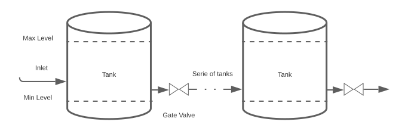

# Using policy gradient to control liquid level in connected tanks

# Image

## Problem Description

A series of tanks are connected with a valve between. There are inlet pipe and outlet pipe connected to the outermost tanks.
The goal is to keep the water level in the tanks as long as possible.

--- Environment --
The liquid level is controlled by the following equation.

, where $h$ is the height of the tank
 is radius of the tank,
 is inlet flow rate per second,
 is valve action (either 1 or 0),
 is pipe area,
is gravity,
 is liquid density,
 is pressure difference between tank surface and atmosphere.
Water flows into the first tank with a flow rate  

Observation includes water level divided by tank height, water level difference to the previous level, whether tank is half-fill and whether valve is opened.
Reward is -5 if water level is outside the limits otherwise it is one.
If one tank's level is outside the limits, then the episode is done.

## requirements
Pytorch, Numpy

